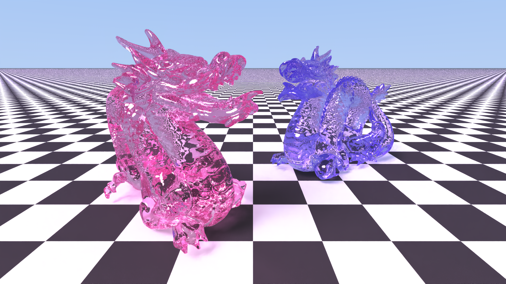

# ˚୨୧⋆ Raytracer ｡˚ ⋆

### A path tracer written using [Elle](https://github.com/acquitelol/elle), [Raylib](https://raylib.com), and OpenGL.

  <table>
    <tr>
      <td width="50%">
        

            
        

      </td>
      <td width="50%">
        

            
        

      </td>
    </tr>
  </table>

> These dragons have 871,306 triangles each! That means the scenes each contain 1,742,612 triangles!

### ♡ **Why does this exist?**

* I had wanted to write a Raytracer for a while, and I finally got the opportunity to do so!

### ♡ **How to build?**

`make` (or `make run` to also run the raytracer)

(Note: you may have to set `ELLE_LIBS` to link with OpenGL for linux.)

### ♡ **Licensing**

* Copyright © 2024 Rosie ([acquitelol](https://github.com/acquitelol))

<a href="#top">⇡ Back to top️!</a>
